## Table of Contents
- [Overview](#overview)
- [Download Open API Specification](#download)
- [Create Action Project](#createAction)
- [Configure Action Project](#configureAction)
- [Test Action Project](#testAction)
- [Summary](#summary)

# Overview 

In this exercise, you will create an action project based on Sales Order API. The [Sales Order (A2X)](https://api.sap.com/api/API_SALES_ORDER_SRV/resource) API is already available in API Business Hub. For this workshop we will leverage Sales Order Header - POST API which will be used to create a sales order in S/4HANA Cloud system after the approval is done.

  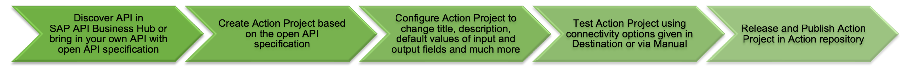

## Download Open API Specification 

1.	[Download and Extract](files/API_SALES_ORDER_SRV.zip) **Open API Specification** zip file for **Sales Order (A2X)** API in your local file system.

    > Note: Open API specification of 2.x or 3.x or higher is needed for creating Action Project. For APIs that are available in [SAP API Business Hub](https://api.sap.com), you can directly download the specification from the API overview section. For example: The API specification that will be used for sales order creation in this exercise is downloaded from [here](https://api.sap.com/api/API_SALES_ORDER_SRV/overview)

## Create Action Project 

2.	Open [SAP Build | Lobby](https://ad261-8v1n91fq-applicationdevelopment.lcnc.cfapps.us10.hana.ondemand.com/lobby) with given username and password:

    - then click **Create**

    | Username | Password    |
    | :------------- | :------------- |
    | AD261_XXX   where XXX is the user number   like AD261_000, AD261_001 etc.       | Acce$$teched22     |

      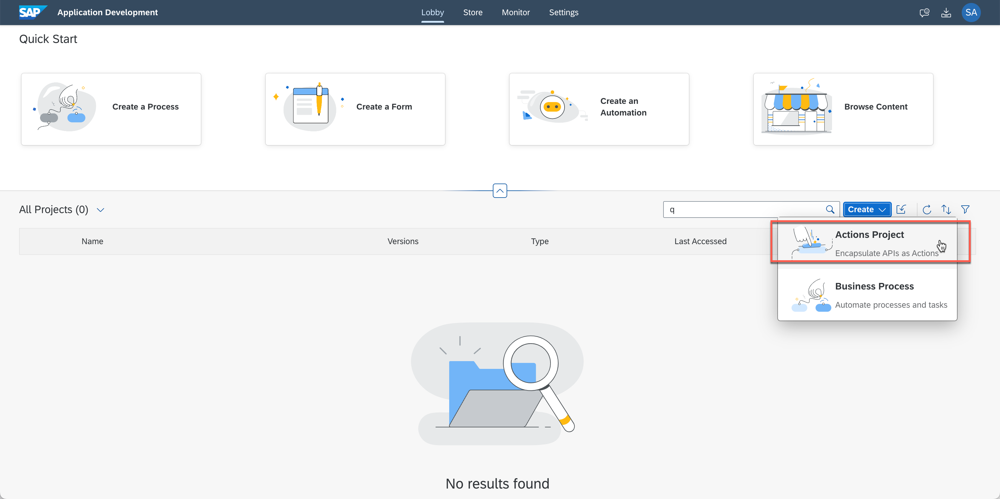

3. In the popup, click **Build an Automated Process** and then select **Actions**

    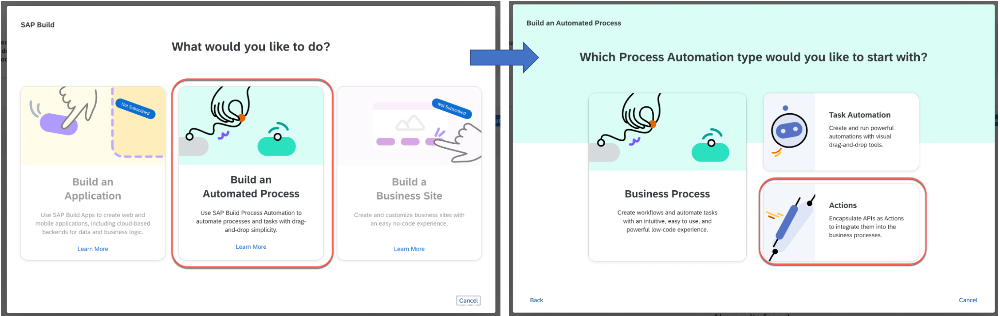

3. In the popup, do the following:
    - Enter the **Project Name** as **Sales Order - UserXXX** where XXX is your user number
    - Enter the **Short Description** as **API to create sales order in S/4HANA cloud system for UserXXX** where XXX is your user number
    - Click to **Browse** the open specification file downloaded in step above
    - Click **Create**

  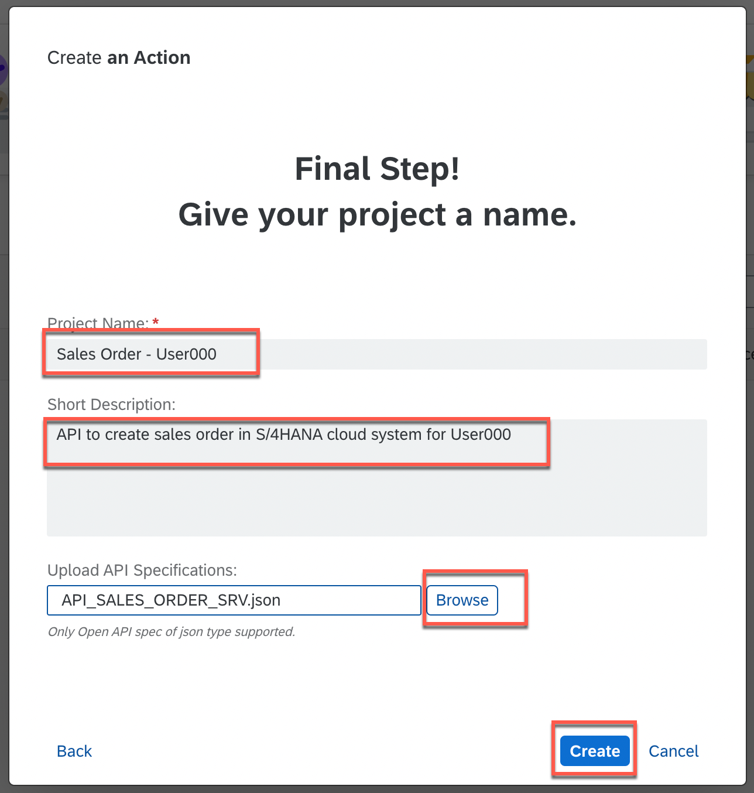

4. Wait for the Action Project to be created in the Lobby

   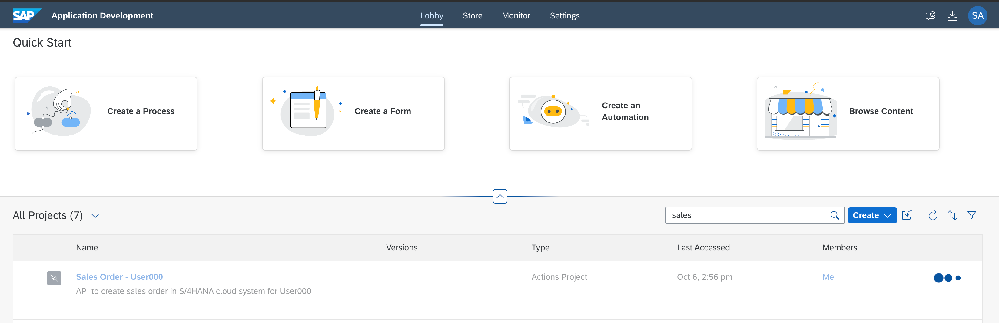

## Configure Action Project 

5. Once the action project is created, the action editor will automatically open. In the popup, you have to select *POST* method of */A_SalesOrder* API. You can either directly search from the given list of APIs or follow the steps below:
    - Select **filter** option

        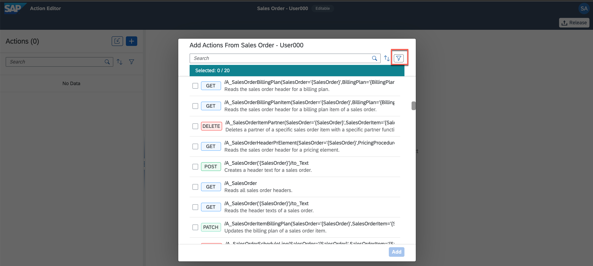

    - Select **Request Type** >> **POST** and click **OK**

      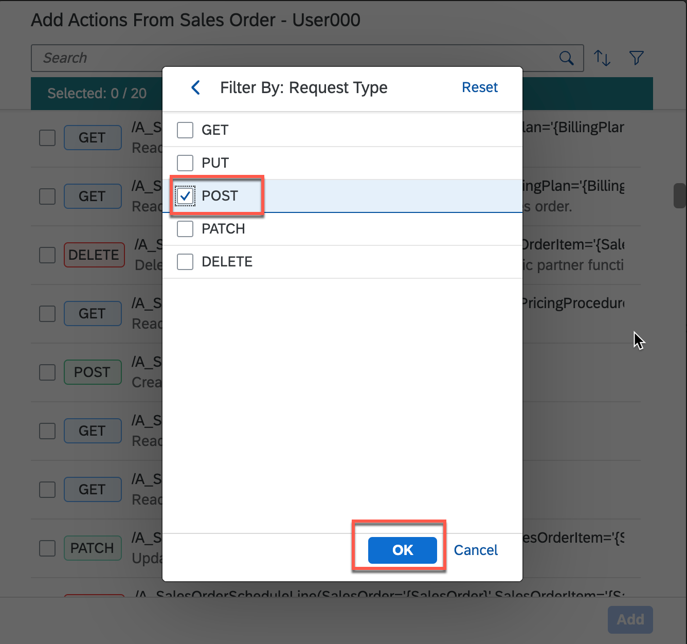

    - From the filtered list of APIs, select **POST** option for **/A_SalesOrder** API
      - Click **Add**

        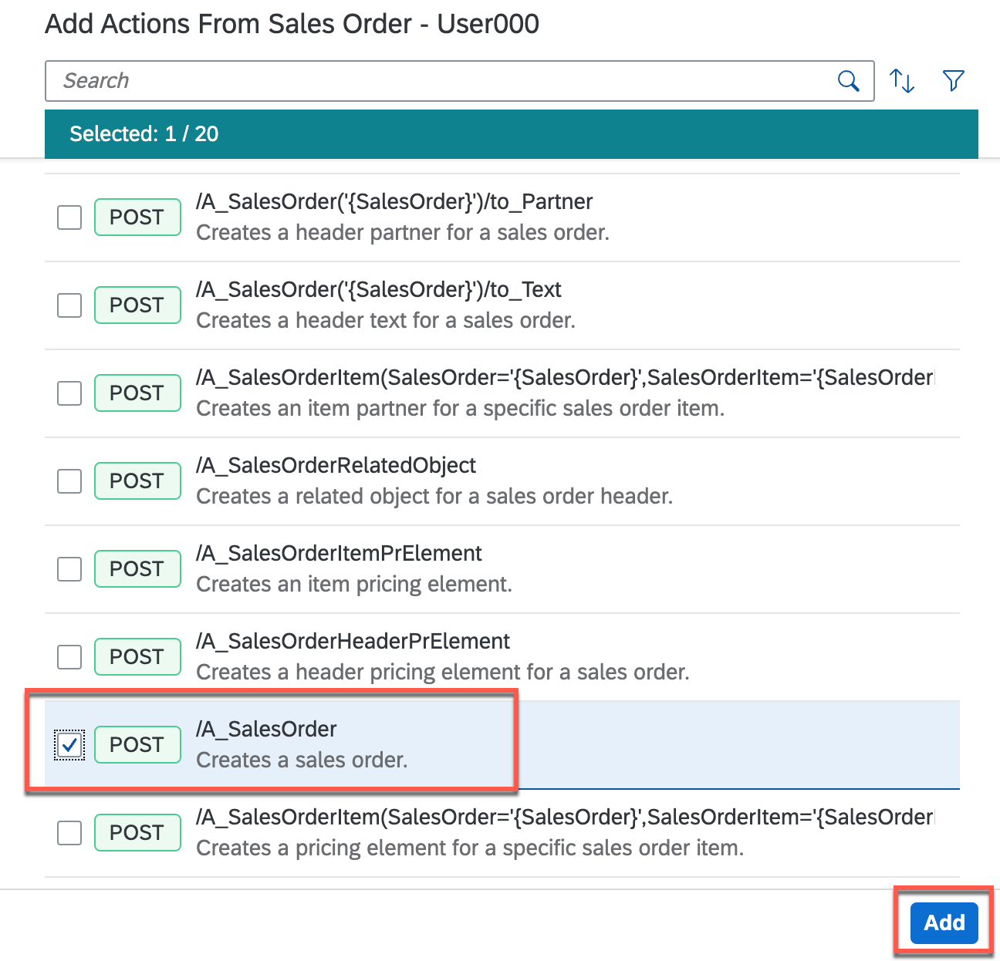

6. Action editor will be opened with the selected APIs which can be further configured based on the requirements:

    - To update the project name, click on the **pencil icon** next to the project name.
    > This action project name will help you search your action project from your API list, once published in action repository.

    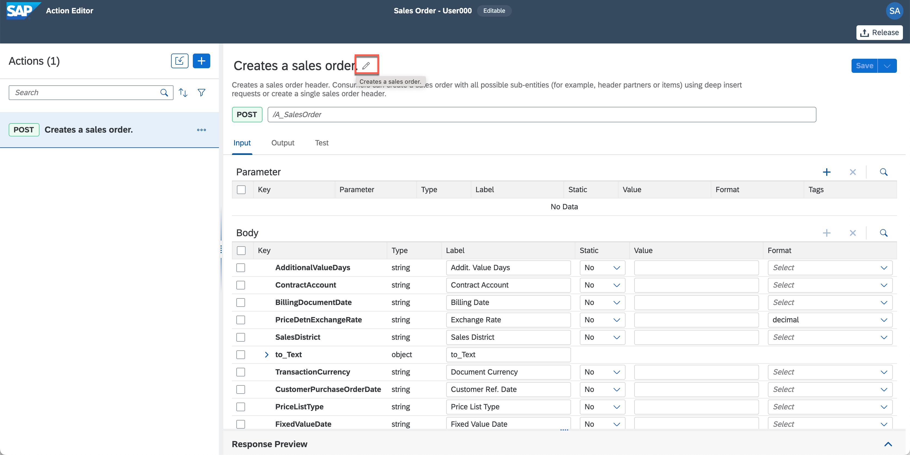

    - Change the name to **Create a sales order for UserXXX** where XXX is your user number
    - Once done, select **check** icon to submit the changes

    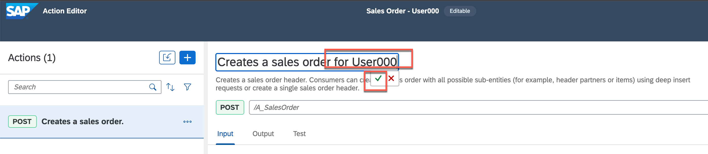

7. Now, you will update the input/output fields of the action project to keep only the mandatory fields that are needed to create the sales order. To select the  **Input** fields, do the following:
    - Sort **Key** in ascending order by clicking on the key column and select the **Sort Ascending** option

    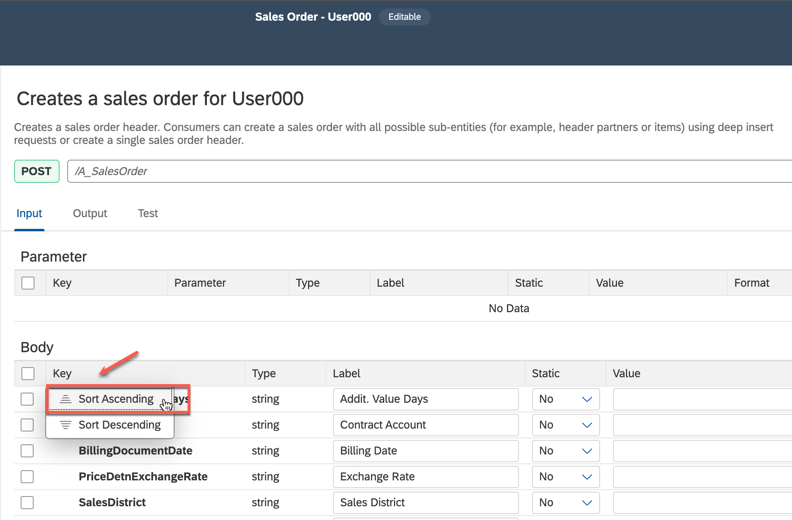

    - Select All the fields by clicking on the checkbox of **Key** column
    - Uncheck the following fields so that they are added as *Input*

      |Keys selected as Input|
      |-|
      DistributionChannel |
      OrganizationDivision |
      PurchaseOrderByCustomer |
      SalesOrderType |
      SalesOrganization |
      SoldToParty |

    - Click **cross** to delete rest of the unwanted fields

      

        - In the confirmation popup, click **Remove**

        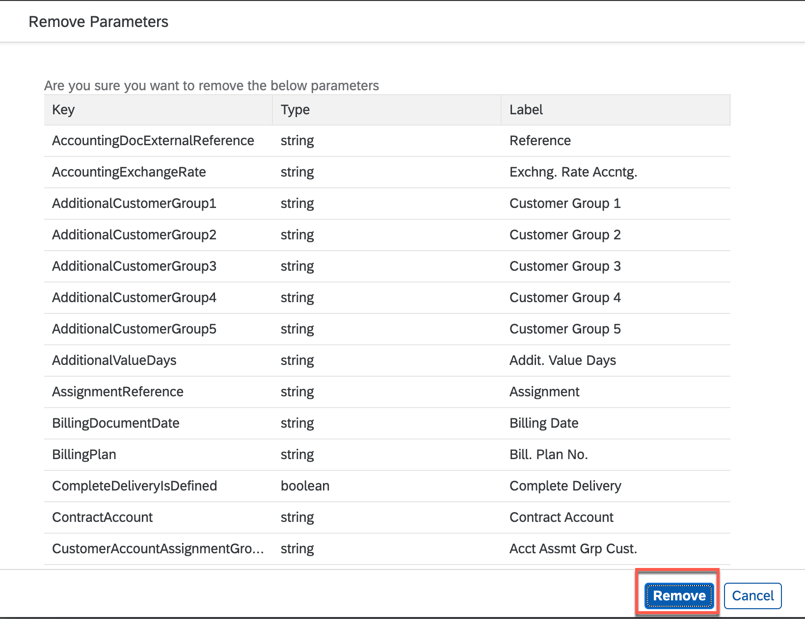

        > If you get message like *The following parameter(s) can't be added because they have unsupported definition* in the pop up then scroll down to add the individual attributes.
        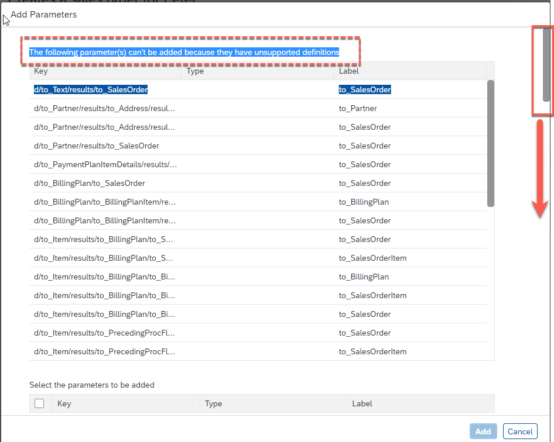

    - Enter the default value for each of the input fields

      |Keys selected as Input| Value
      |-|-|
      DistributionChannel | 10 |
      OrganizationDivision | 00 |
      PurchaseOrderByCustomer | UserXXX  where  XXX is your user number |
      SalesOrderType | OR |
      SalesOrganization | 1710 |
      SoldToParty | 17100006 |

      > Use can also change Labels of the fields

      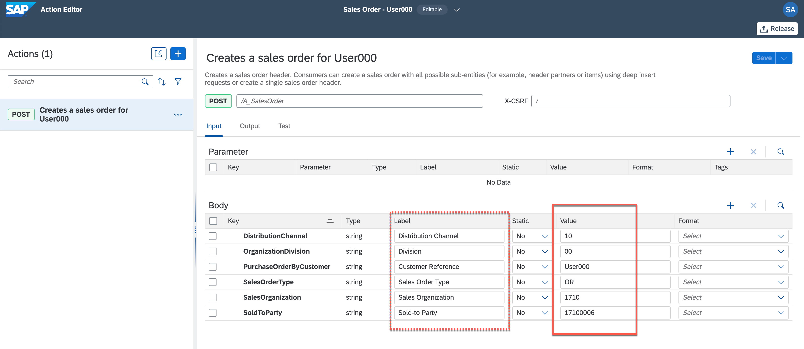

    - **Save** the changes.

      > If you get Gateway Timeout issue while saving, then close the error dialog and refresh the browser.  

      > If you see that changes are not saved, then try saving again and refreshing the browser

8. As S/4HANA APIs need CSRF token, click **...** of the POST API on the left panel and select **Enable X-CSRF**

  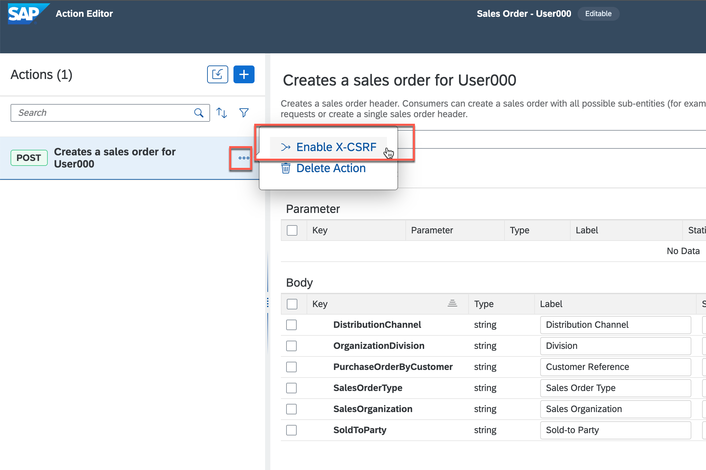

  - In the popup, enter **/** and click **Add X-CSRF**
  > Note: Action project uses Destination service to execute the API. In the destination we have already create the URL Path as `https://my-api.s4hana.cloud.sap/sap/opu/odata/sap/API_SALES_ORDER_SRV` to call the API. So, while configuring XSRF token path you do not have to enter any explicit path rather use standard URL configured in the destination.

  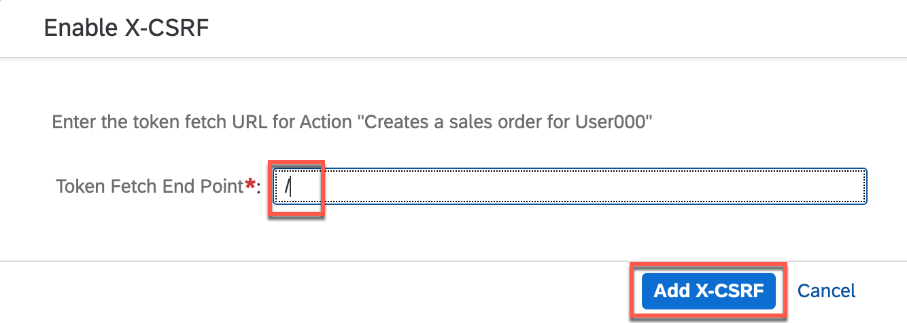

9. With this you have configured the action project name, XSRF token and API input fields. **Save** the work.

  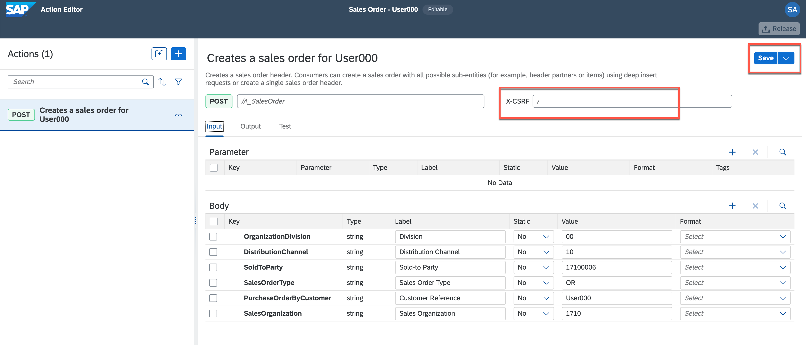

10. Similarly, configure the output fields. Do the following:
    - Click **Output** tab
    - Sort the keys in **Ascending Order**
    - Select all the keys
    - Uncheck the following keys the are needed as *Output*

      |Keys selected as Output|
      |-|
      CreatedByUser |
      CreationDate |
      DistributionChannel |
      OrganizationDivision |
      PurchaseOrderByCustomer |
      RequestedDeliveryDate |
      SalesOrder |
      SalesOrderDate |
      SalesOrderType |
      SalesOrganization |
      SoldToParty |
      TotalNetAmount |

    - Click **cross** to delete rest of the unwanted output fields
    - **Save** the changes

      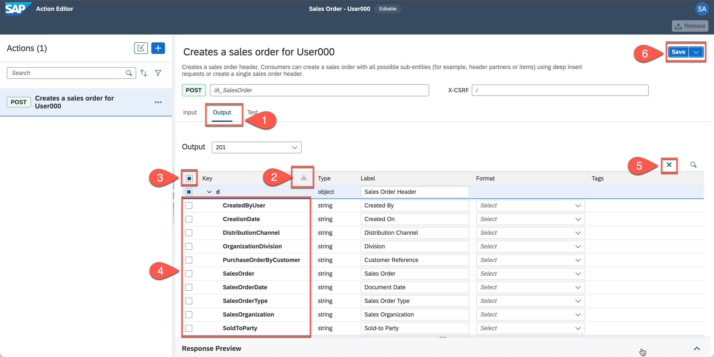

      > If you get Gateway Timeout issue while saving, then close the error dialog and refresh the browser.  

      > If you see that changes are not saved, then try saving again and refreshing the browser

## Test Action Project 

11. Once the action project is configured and saved, it is time to test the changes and output. To test the API, do the following:

    - Click **Test** tab
    - Select **Destination** option under **Connectivity**
    - Select **S4HANACloud_AD261** from the dropdown options
    > The destinations are fetched from the SAP Business Technology Platform. The selected destination is already created in the account configured for this workshop.

      > Notice that the input value is already picked from the default value entered while configuring the action project.

    - Click **Test**

      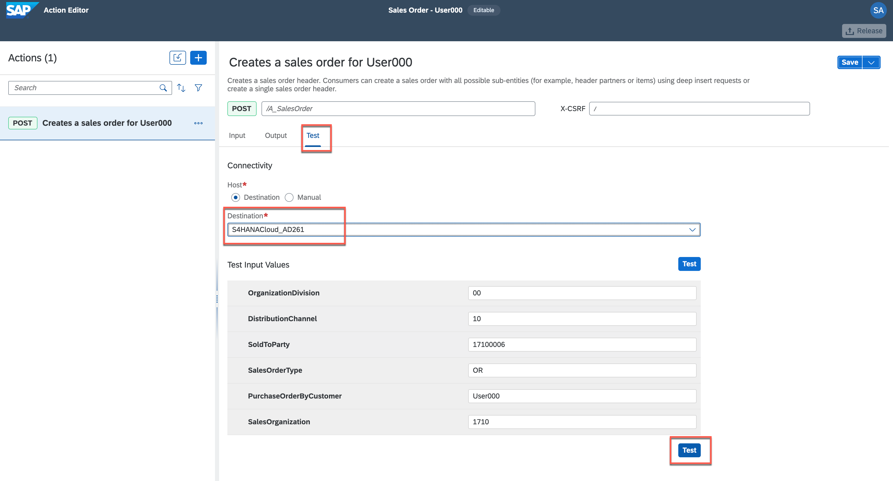

    - Once the execution is successful, you see **201 Created** response with the details of the new sales order being created in the backend S/4HANA Cloud system.

      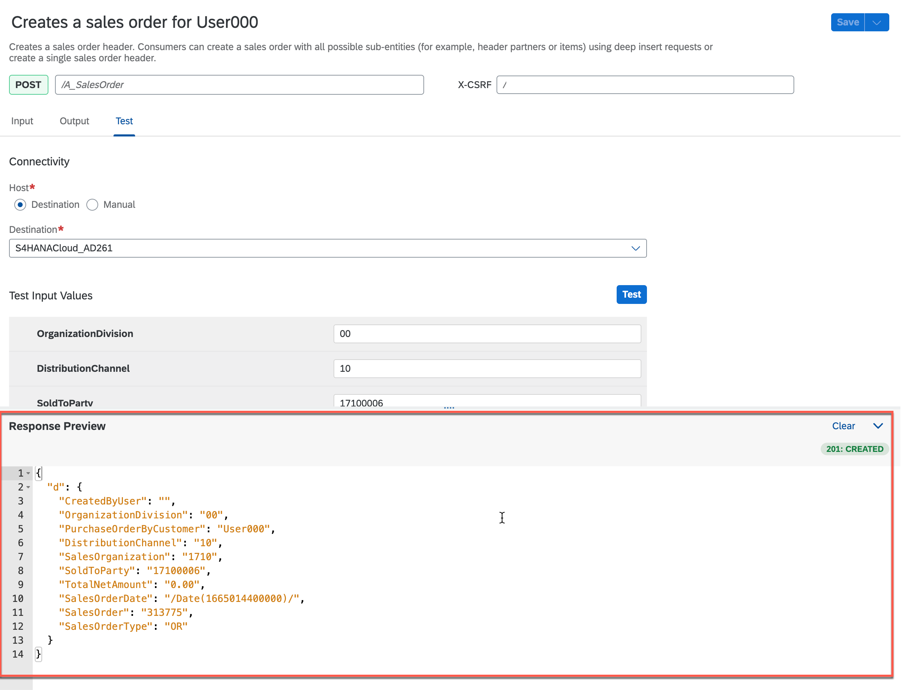

With this you have successfully created, configured and tested the action project based on Sales Order API in SAP Build Process Automation.

## Summary 

Now, that you have created the action project. It time to release and publish to the action repository from where it can be consumed by the processes and applications.

Continue to - [Exercise 2 - Publish Action Project](../2_PublishActionProject/README.md)
