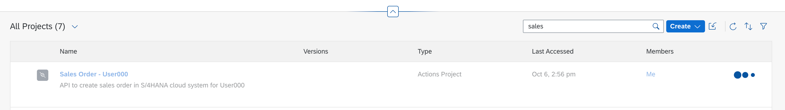
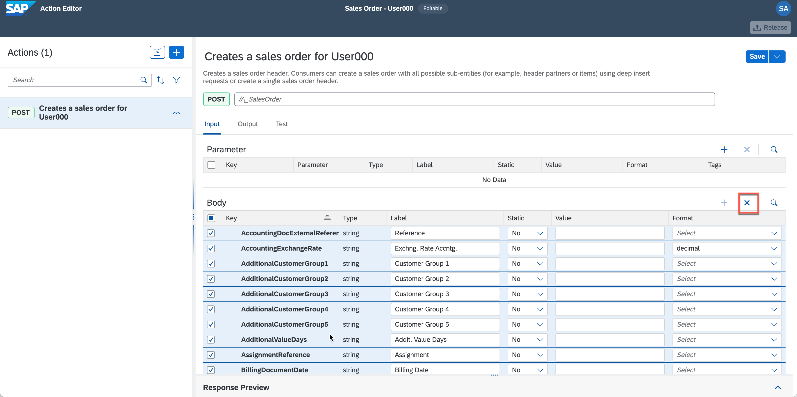

# Create Action Project

### Overview
In this exercise, you will create an action project based on Sales Order API. The [Sales Order (A2X)](https://api.sap.com/api/API_SALES_ORDER_SRV/resource) API is already available in API Business Hub, for this workshop we will leverage Sales Order Header - POST API to create an Action Project in SAP Process Automation that will eventually create a sales order in S/4HANA Cloud system after the approval is done.

## Download API Specification

1.	[Download](files/API_SALES_ORDER_SRV.json) **Open API Specification** for **Sales Order (A2X)** API in your local file system.

    > Note: Open API specification of 3.x or higher is needed for creating Action Project. For APIs that are available [SAP API Business Hub](https://api.sap.com) you can download the specification directly. For example: The API specification that will be used for sales order creation is  downloaded from [here](https://api.sap.com/api/API_SALES_ORDER_SRV/overview)

## Create Action Project

2.	Open [SAP Process Automation - Application Developement Workbench](https://ad261-8v1n91fq-applicationdevelopment.lcnc.cfapps.us10.hana.ondemand.com/lobby) and click **Create** >> **Actions Project** option

   

3. In the popup, do the following:
    - Enter the **Project Name** as **Sales Order - UserXXX** where XXX is your user number
    - Enter the **Short Description** as **API to create sales order in S/4HANA cloud system for UserXXX** where XXX is your user number
    - Click to **Browse** the open specification file downloaded in step above
    - Click **Create**

     

    

4. Wait for the Action Project to be created

   

5. Once the action project is created, the action editor will automatically be opened. In the popup, you have to select *POST* method of */A_SalesOrder* API. To do that easily, do the following:
    - Select **filter** option

        

    - Select **Request Type** >> **POST** and click **OK**

      

    - Select **POST** option for **/A_SalesOrder** API
      - Click **Add**

        

6. Action editor will be opened with the selected APIs which can be further configured based on the requirement
    - To update the project name, click on the **pencil icon** next to the project name. This name will help you search from your APIs once published in API repository.

    

    - Change the name to **Create a sales order for UserXXX** where XXX is your user number
    - Once done, select **check** icon to submit the changes

    

7. Now, you will update the action input/output to keep only the fields that are needed to create the sales order. To trim the  **Input** fields first, do the following:
    - Sort **Key** in ascending order by clicking on the key column and select the **Sort Ascending** option

    

    - Select All the fields
    - Uncheck the following fields so that they are added as *Input*

    |Keys as Input|
    |-|
    DistributionChannel |
    OrganizationDivision |
    PurchaseOrderByCustomer |
    SalesOrderType |
    SalesOrganization |
    SoldToParty

    - Click **cross** to delete rest of the unwanted fields

      

        - In the confirmation popup, click **Remove**

        

8. As S/4HANA APIs need CSRF token, click **...** of the POST API on the left panel and select **Enable X-CSRF**

  

    - In the popup, enter **/** and click **Add X-CSRF**
    > Note: Action project uses Destination service to execute the API. In the destination we have already create the URL Path as `https://my-api.s4hana.cloud.sap/sap/opu/odata/sap/API_SALES_ORDER_SRV` to call the API. So, while configuring XSRF token path you do not have to enter any explicit path rather use standard URL configured in destination.

     

9. With this you have configured the action project name, XSRF token and API input fields. **Save** the work.

  

10. Similarly, configure the output fields. Do the following:
    - Click **Output** tab
    - Sort the keys in **Ascending Order**
    - Select all the keys
    - Uncheck the following keys the are needed as *Output*

      |Keys as Output|
      |-|
      CreatedByUser |
      CreationDate |
      DistributionChannel |
      OrganizationDivision |
      PurchaseOrderByCustomer |
      RequestedDeliveryDate |
      SalesOrder |
      SalesOrderDate |
      SalesOrderType |
      SalesOrganization |
      SoldToParty |
      TotalNetAmount |

    - Click **cross** to delete rest of the unwanted output fields
    - **Save** the changes

      

11. Once the action project is configured, it is time to test the changes and output. To test the API, do the following:

    - Click **Test** tab
    - Select **Destination** option under **Connectivity**
    - Select **S4HANACloud_AD261** from the dropdown options
    > The destinations are fetched from the SAP Business Technology Platform. This destination is already created in the account configured for this workshop.

      > The input value is already picked from the default value entered while configuring the action project.

    - Click **Test**

      

    - Once the execution is successful, you see **201 Created** response with the details of the new sales order being created in the backend S/4HANA Cloud system.

      

###### With this you have successfully created, configured and tested the Sales Order API in SAP Process Automation.

## Summary

Now that you have created the action project. It time to release and publish it to the action repository from where it can be picked to be used in processes and applications.

Continue to - [Exercise 1.2 - Publish Action Project](../2_PublishActionProject/README.md)
