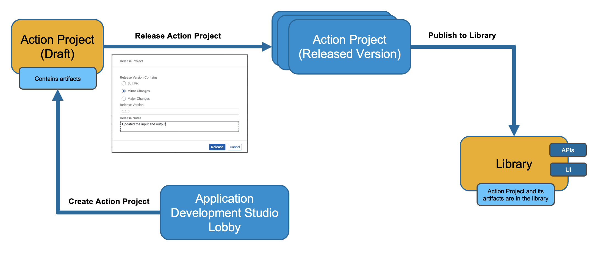

# Release and Publish Action Project

### Overview
In this exercise, you will release the action project to create version(s) and then publish a selected version in the action repository. It is then these published actions can be used in different processes and applications to connect to external systems.

## Release Action Project

- To release a version of the action project, click **Release** from top-right corner

  

- In the release popup, enter the **Release Notes** of your choice and click **Release**

  > Note the version of the project. It is in `majorVersionNumber.minorVersionNumber.patchNumber` format

  

## Publish Action Project

Once the action project is released, you can the publish any release version of the action by clicking **Publish to Library** from top-right corner

## Summary

In the first two exercises, you have learnt how to:  
- [x] Discover APIs in SAP API Business Hub.
- [x] Download API specification.
- [x] Create Action Project based on the API specification.
- [x] Configure API methods to update title, input and output fields and their description to improve readability for business users.
- [x] Test API using destination option
- [x] Release and publish action project to be consumed in the business process modelling.

With this you have successfully complete first section of your workshop. Creating, configuring, releasing and publishing Action Project are mandatory if you want your process to connect to external systems via APIs.

Continue to - [Exercise 3 - Import Sample Process From Store](../3_ImportSampleProcess/README.md)
