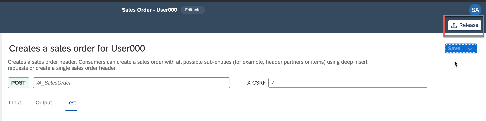
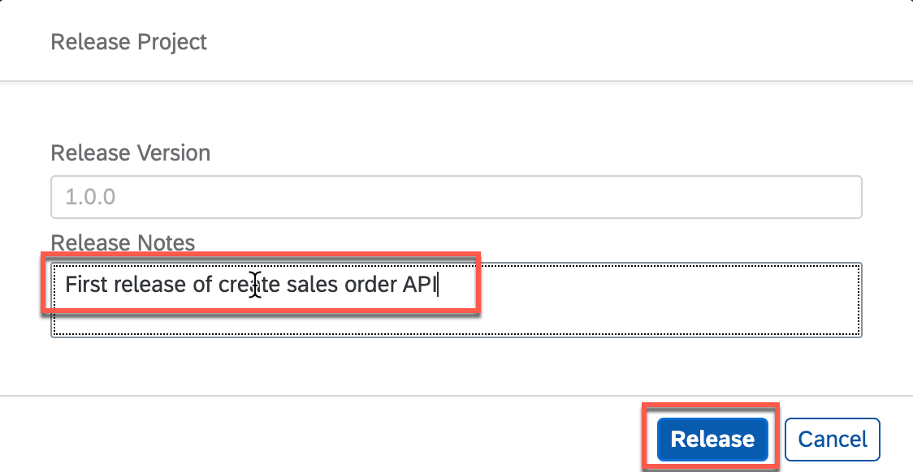
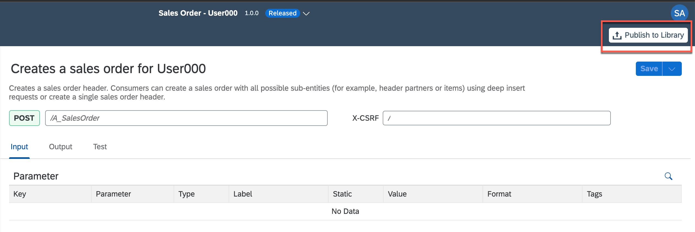

# Release and Publish Action Project

In this exercise, we will create...

### Overview

## Release Action Project

To release a version of the API, click **Release** from top-right corner

In the release popup, enter the **Release Notes** of your choice and click **Release**

> Note the version of the project. It is in `majorVersionNumber.minorVersionNumber.patchNumber` format

## Publish Action Project

Once the API is released, you can the publish the API by clicking **Publish to Library** from top-right corner

## Summary

You've now ...

Continue to - [Exercise 2 - Exercise 2 Description](../ex2/README.md)
