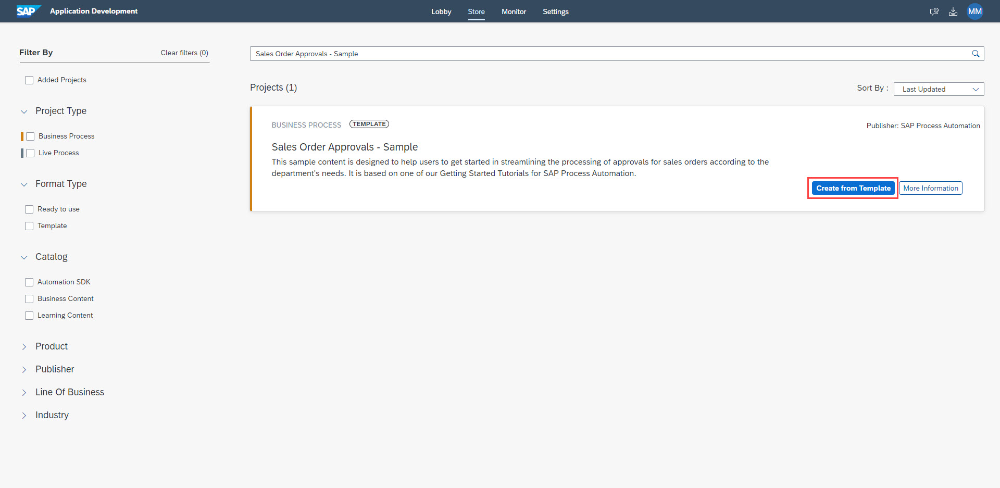
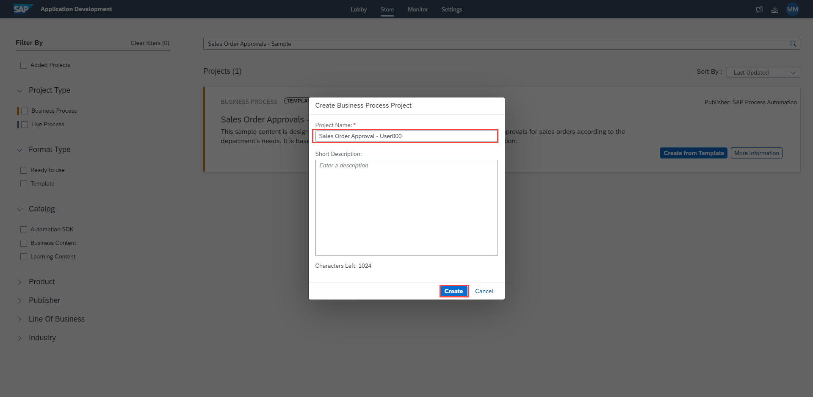

# Import Sample Process
## Overview
In this exercise, we will import a sample process into your project.

## Import Sample as Template

1. From the Lobby of SAP Process Automation, click on the **Store** tab

    

2. On the **Store** page, search for - **Sales Order Approvals - Sample** and once it loads, click **Create from Template**.

    

3. In the **Project Name** field, enter **Sales Order Approval - UserXXX** where XXX is your user number.
    - click "Create"

    

    > Wait for the project to be imported. Once the project is imported successfull you can switch to Lobby to see the imported projects

## Summary

You've now imported a sample process and are ready to configure it, starting with the environment variable

Continue to - [Exercise 4 - Add environment variable](../4_AddEnvironmentVariable/README.md)
