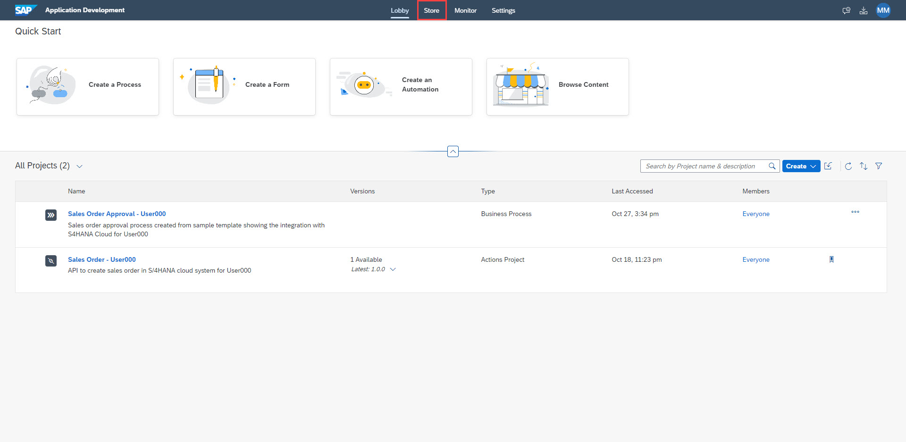

# Import Sample Process
## Overview
In this exercise, we will import a sample process into your project.

## Import Sample as Template

1. From the Lobby of SAP Process Automation, click on the store tab

2. On the Store page, search for - "Sales Order Approvals - Sample" and once it loads, click "Create from Template"

3. In the "Project Name" field, type "Sales Order Approval - User000" with your user number in place of "000" and click "Create"

## Summary

You've now imported a sample process and are ready to configure it, starting with the environment variable

Continue to - [Exercise 3 - Excercise 3 ](../ex3/README.md)
