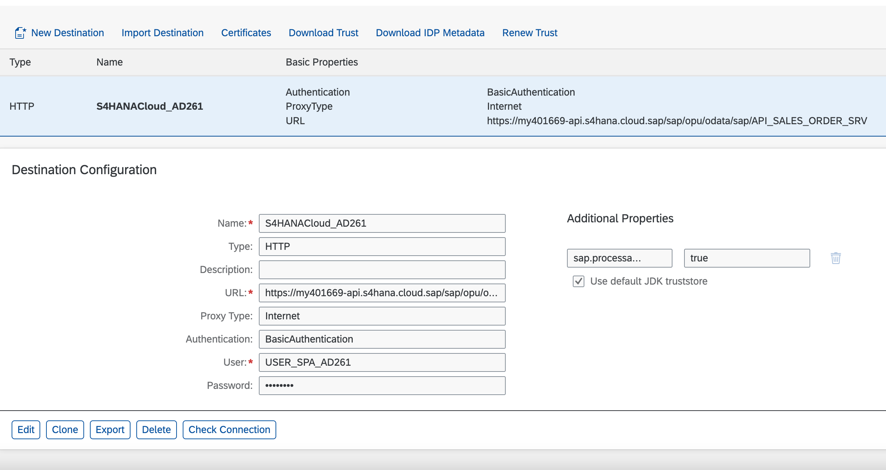
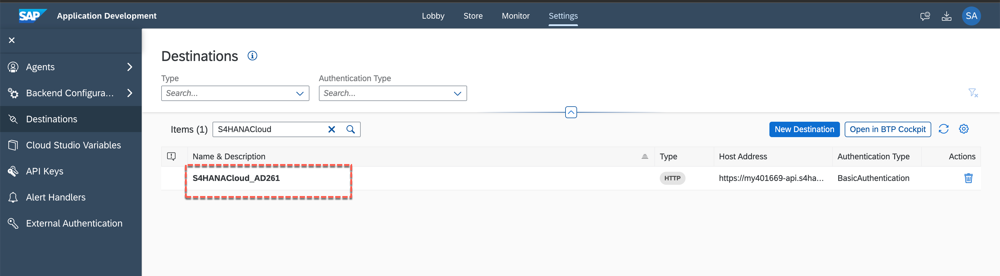
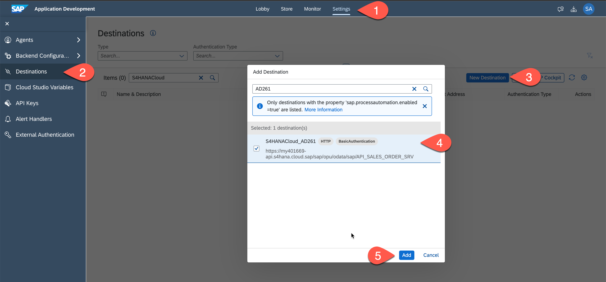
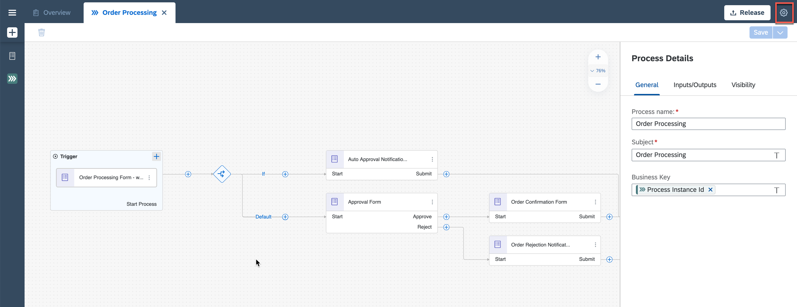
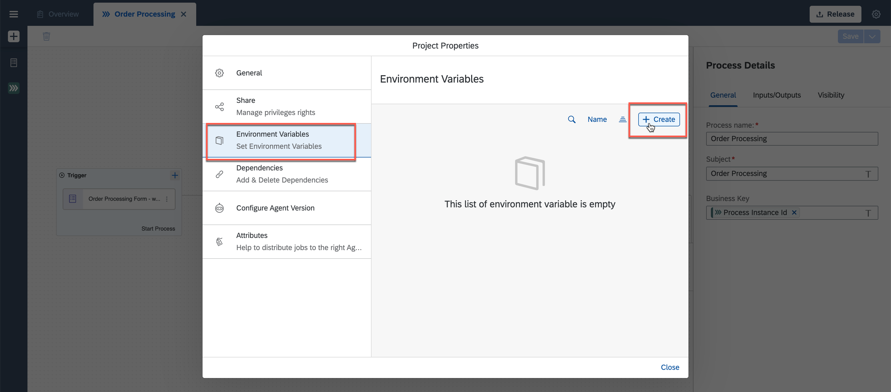
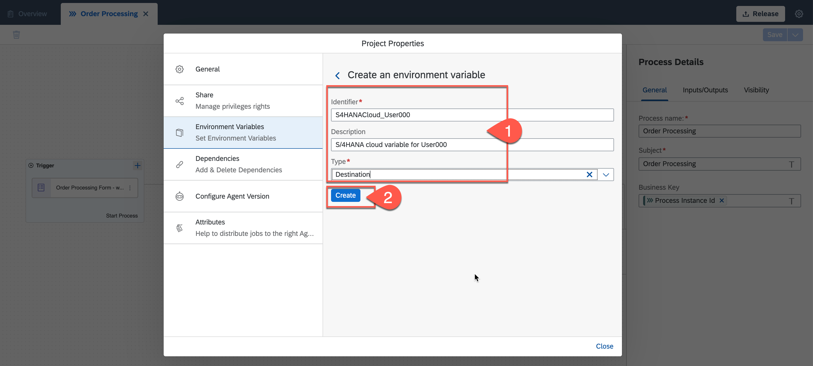
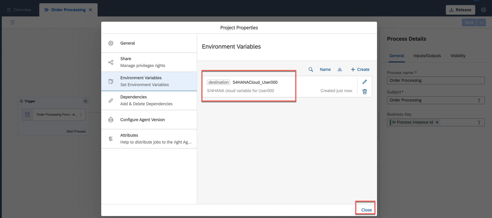

## Table of Contents
- [Overview](#overview)
- [Create Destination in SAP BTP Account](#createdestination)
- [Add Destination in SAP Build Process Automation](#adddestination)
- [Add Environment Variable to Access Destination](#accessdestination)
- [Summary](#summary)

# Overview 

In this exercise, you will create an environment variable to access the destination created in SAP Business Technology Platform. A destination is needed to connect to the S/4HANA system to execute the APIs. The destination-based environment variable will be used to configure the Action of the business process.

## Create Destination in SAP BTP Account 

For this workshop, a destination is already created in SAP BTP account. This destination will connect to SAP S/4HANA Cloud system with the given user credentials to create sales order, once approval is done via the business process.

> Note that there is a property **sap.processautomation.enabled** added to the destination. The destinations which have this property set as true can be discovered and added in SAP Build Process Automation.

## Add Destination in SAP Build Process Automation 

As there is only one pre-created destination for this workshop, the same destination is already added to the SAP Build Process Automation.

To see the destination, go to **Settings** >> **Destinations** in your **Application Development Workbench** and search for **S4HANACloud**. You will see a destination with name **S4HANACloud_AD261** already added.

> This destination will be associated with the environment variable while deploying the business process.

> In general, to add the destination you have to go to Settings > Destinations section and then click New Destination to add the SAP BTP destination.

## Add Environment Variable to Access Destination 

1. Click to go back to **Lobby** and open your business project. From your project overview section, click to open **Order Processing** process.

    - In the process builder, click to open **Project Properties** from top-right corner of the page

    

2. In the **Project Properties** pop-up, select **Environment Variables** and click **Create** to create an environment variable for this business processes.

    

3. Enter the following to create an environment variable:

    - **S4HANACloud_UserXXX** where XXX is your user number as **Identifier**
    - Any **Description** of your choice
    - **Destination** as variable type

    

    - Click **Create**

4. Once the environment variable is created, **Close** the project properties pop-up.

  

## Summary 

You have successfully created and configured the destination to be accessed while configuring business process.

Continue to - [Exercise 5 - AddAction](../5_AddAction/README.md)
