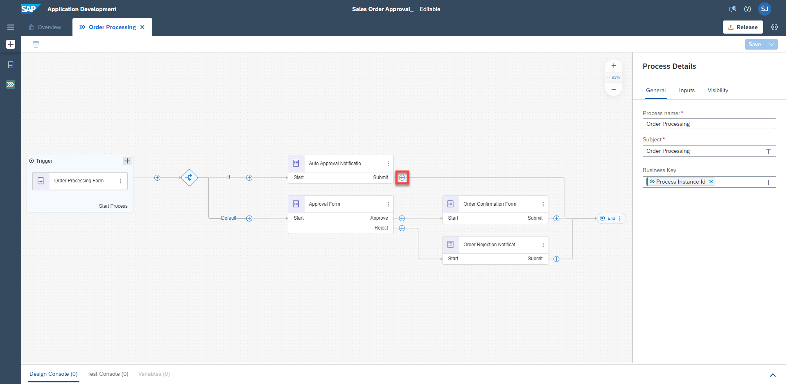
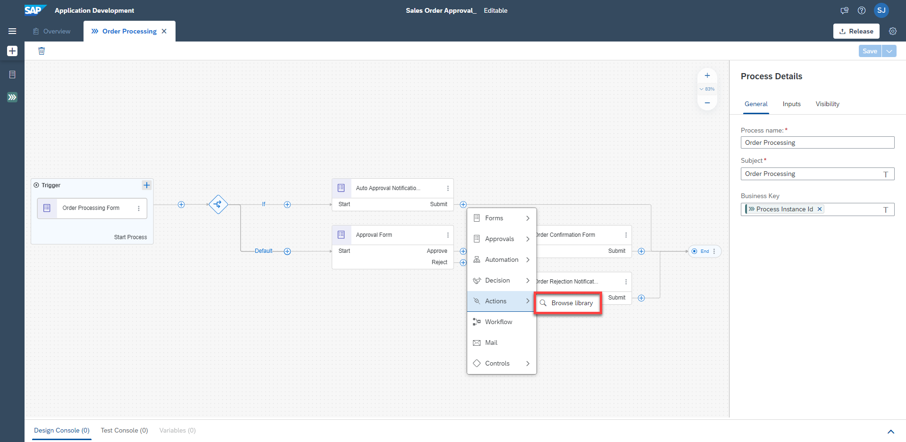
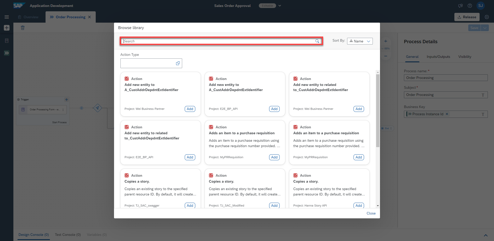
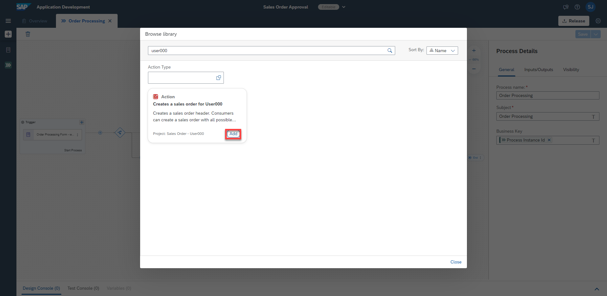
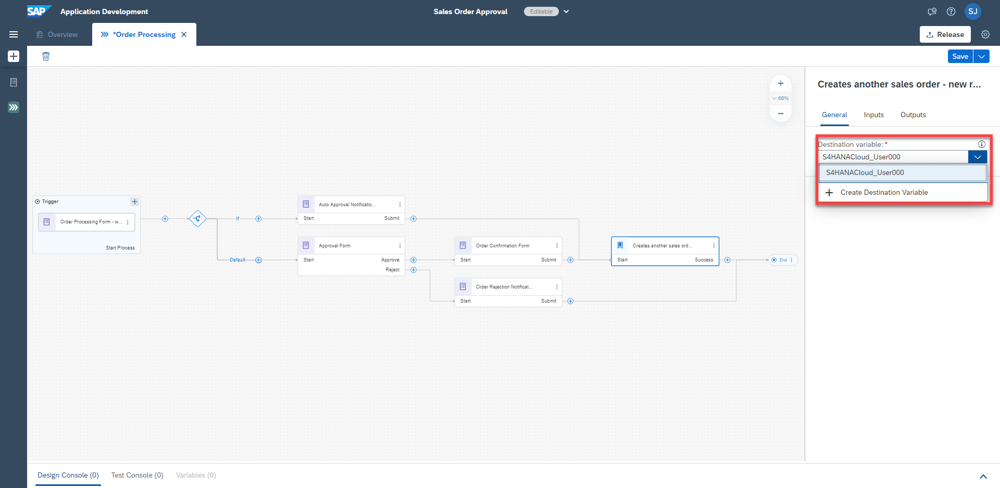
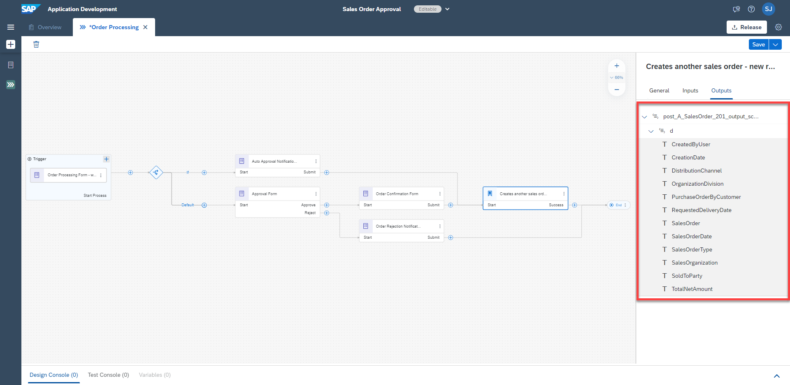
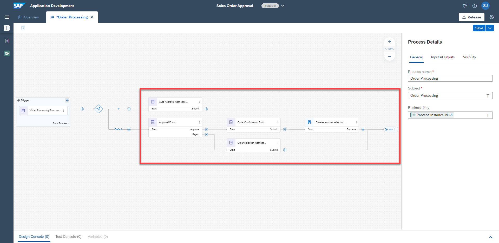

## Table of Contents
- [Overview](#section1)
- [Add Actions Project](#section2)
- [Configure Actions Project](#section3)
- [Summary](#section4)

## Overview 

In this exercise, you will add the Actions project you previously created. You can do this by choosing the proper project from the Actions library, then configuring the Actions parameters.

## Add Actions Project 

1. In the Process canvas, click the **+** button

    

2. In the list, choose **Actions**, then **Browse library**

   

3. The Actions library should be shown. Enter your **UserXXX**, where XXX is your user number identifier, to find the Actions project you created

   

3. Click **Add** on your Actions project

   

## Configure Actions Project 

1. Under the **General** tab of your Actions project parameters, choose the corresponding **Destination variable** that you previously created.

2. Under the **Inputs** tab of your Actions project parameters, map each input to the proper variable.

    | Input Field | Process Content |
    |---|---|
    | DistributionChannel | Order Processing Form > Distribution Channel |
    | OrganizationDivision | Order Processing Form > Division |
    | PurchaseOrderByCustomer | Order Processing Form > Purchase Order Number |
    | SalesOrderType | Order Processing Form > Sales Order Type |
    | SalesOrganization | Order Processing Form > Sales Organisation |
    | SoldToParty | Order Processing Form > Shit To Party (Customer) |

   

3. Under the **Outputs** tab, check to make sure all outputs are as seen in the image below.

   
  

4. Route the process accordingly by connecting the output lines from the **Auto Approval Notification** Form and **Order Confirmation Form** to the input of the Actions Project you just added. Connect the output line from the **Order Rejection Notification** Form to the **End** node. Your project should look like the image below.

    > You can connect these nodes by simply dragging and dropping the lines. If a connected line can't be moved, simply click and delete the line, then drag and drop the resulting unconnected line to the proper node

   

## Summary 

You have successfully added and configured an Actions project.
    > If needed, you can refer to the [Documentation](https://help.sap.com/docs/PROCESS_AUTOMATION/a331c4ef0a9d48a89c779fd449c022e7/31006f693b6142b2ba6751cf5e2a8b2a.html?version=Cloud)

Continue to - [Exercise 7 - ConfigureLaunchpad](../7_ConfigureLaunchpad/README.md)
