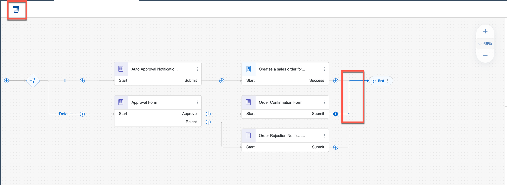
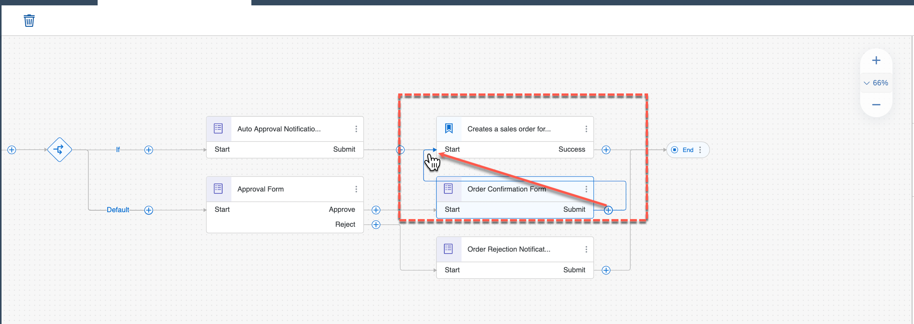
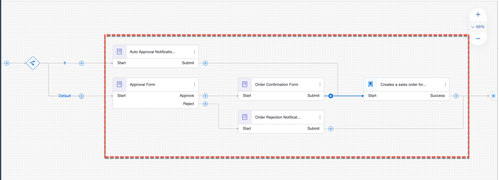

## Table of Contents
- [Overview](#section1)
- [Add Actions Project](#section2)
- [Configure Actions Project](#section3)
- [Summary](#section4)

## Overview 

In this exercise, you will add the Action in the business process to connect to backend system. You can do this by choosing the relevant action from the Actions library, and then configuring the Action's parameters.

## Add Actions Project 

1. In the Process Builder canvas, click the **+** in output connector of **Auto Approval Notification**

    

2. In the list, choose **Actions** > **Browse library**

   

3. In the Action Library pop up, enter your user number like **UserXXX**, where XXX is your user number identifier, to find the list of actions published by you in the library.

   

3. From the filtered list of actions, click **Add** on the action which is to create sales order for your user.

    > This will add the action to connect to backend system in your business process

   

## Configure Actions Project 

1. In **General** tab of Action parameters, choose the corresponding **Destination variable** that you previously created.

    

2. Click **Inputs** tab, and map each input to the actual process content.

    | Input Field | Process Content |
    |---|---|
    | DistributionChannel | Order Processing Form > Distribution Channel |
    | OrganizationDivision | Order Processing Form > Division |
    | PurchaseOrderByCustomer | Order Processing Form > Purchase Order Number |
    | SalesOrderType | Order Processing Form > Sales Order Type |
    | SalesOrganization | Order Processing Form > Sales Organisation |
    | SoldToParty | Order Processing Form > Ship To Party (Customer) |

    

3. In **Outputs** tab, check to make sure all outputs are same as defined in the action project.

   

4. Finally, update the connections of **Order Confirmation Form** activity in the business process such that once the order is confirmed the sales order is created in the backend system.

    - select and delete the output connector from **Order Confirmation Form** to **End** activity.

    

    - Drag and drop the **+** in the output connector of **Order Confirmation Form** to the Action activity.

    

    > You can connect these nodes by simply dragging and dropping the lines. If a connected line can't be moved, simply click and delete the line, then drag and drop the resulting unconnected line to the proper node

   The final process should be same as shown below. Ensure that you have the right connections such that *Auto Approval Notification Form* and *Order Confirmation Form* connects to *Action* activity. 

   

## Summary 

You have successfully added and configured an Actions project. You can learn more from [help portal documentation](https://help.sap.com/docs/PROCESS_AUTOMATION/a331c4ef0a9d48a89c779fd449c022e7/31006f693b6142b2ba6751cf5e2a8b2a.html?version=Cloud)

In this exercise, you have learnt how to:  
- [x] Discover Action from Action Library.
- [x] Add and configure action to the business process .
- [x] Map input fields of the action to the actual process content.

Continue to - [Exercise 6 - Release And Deploy Process](../6_ReleaseAndDeployProcess/README.md)
