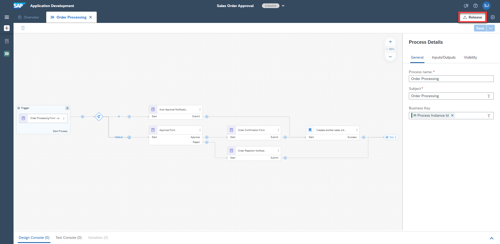
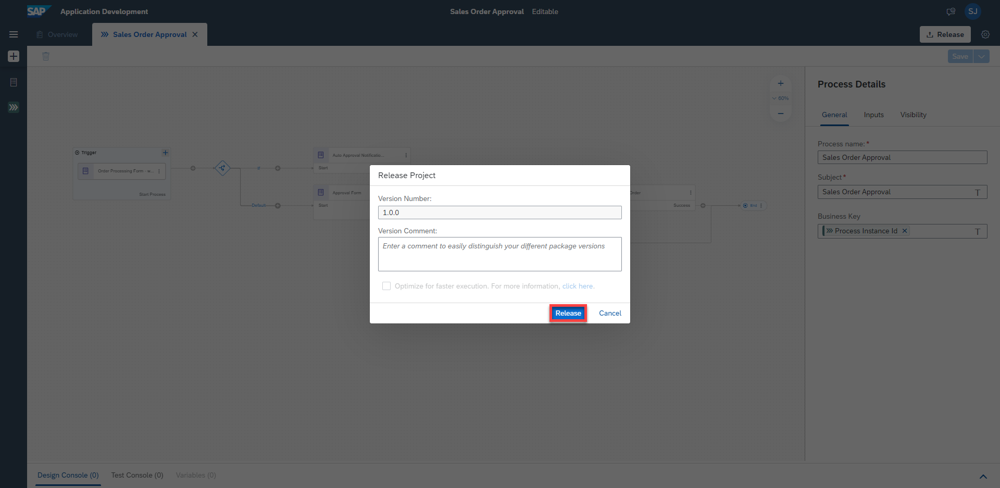
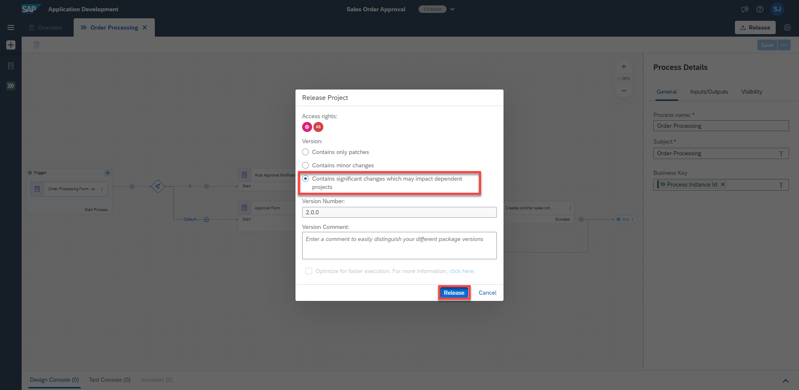
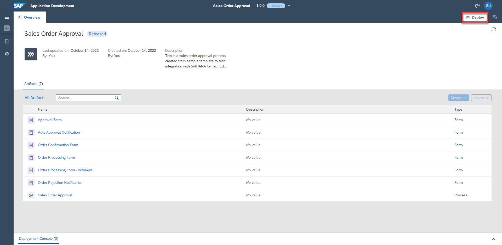
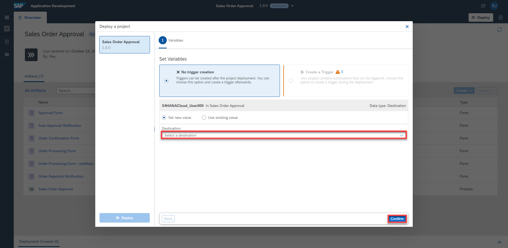
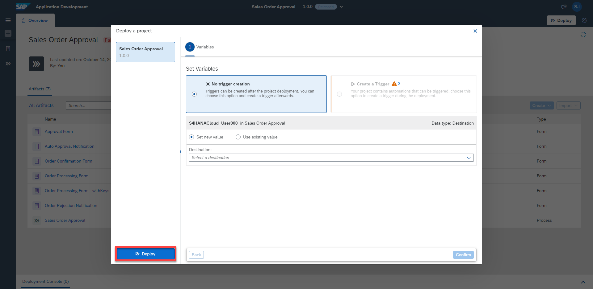
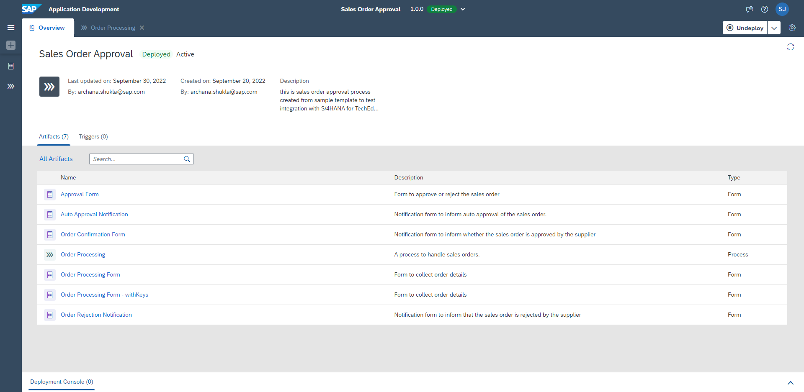

## Table of Contents
- [Overview](#section1)
- [Release Business Project](#section2)
- [Deploy Business Project](#section3)
- [Summary](#section4)

## Overview 

In this exercise, you will release and deploy your project. The release process allows for semantic version control with format X.Y.Z, where you will be able to increment your project release version based on a major version change (X), minor version change (Y), or bug/patch version change (Z). Deploying your project will allow you to set the proper parameters, if necessary, to allow for project execution.

## Release Business Process Project 

Release individual projects once they are finished.

There are two possible  situations:
   - When you're releasing a new business process project, enter a brief summary of the changes in the **Release Notes** (optional) then Choose **Release**
   - When you're releasing a modified version of a business process project that is already released, in the Release **Version Contains dialogue**, select one of the following:
        - Select **Bug Fix** to indicate bug fixes. It updates the third digit of the version number.
        - Select **Minor Changes** to indicate small modifications. It updates the second digit of the version number.
        - Select **Major Changes** to indicate important modifications potentially leading to incompatibility between versions. It updates the first digit of the version number.

1. In the Process Builder, click on **Release**

    

2. For the first version, add a **Version Comment** if needed and click on **Release**

   

3.  For the additional version, choose the type of version, add a **Version Annotation** if needed and click on **Release**

   

4. The successfully released project is ready to be deployed
    > If needed, you can refer to the [Documentation](https://help.sap.com/docs/PROCESS_AUTOMATION/a331c4ef0a9d48a89c779fd449c022e7/bcb638ecb98d4e1db8267ecccd8ffdf3.html?version=Cloud)

   

## Deploy Released Project

You can deploy business process projects from each released version of the project in the Process Builder or through Lobby.

1. From the released version of the business process project in the Process Builder, click on **Deploy**

2. Fill the **Variables** and click on **Confirm**

   > Variables allow you to reuse certain information for a given business process project deployement.

   >  You use variables to pass parameters to automations. You can create variables in the Process Builder for which you can later set values when deploying the  business process project. For example, in the current use case, we create a "Destination" variable. Please use destination "S4HANACloud_AD261".

   

3. Click on **Deploy**

   

4. The successfully deployed project is ready for running and monitoring
    > If needed, you can refer to the [Documentation](https://help.sap.com/docs/PROCESS_AUTOMATION/a331c4ef0a9d48a89c779fd449c022e7/d1e6a2d496f24ef1be43c2da8716c3b6.html?version=Cloud)

   

## Summary 

You have successfully released and deployed your project.

Continue to - [Exercise 7 - ConfigureLaunchpad](../7_ConfigureLaunchpad/README.md)
