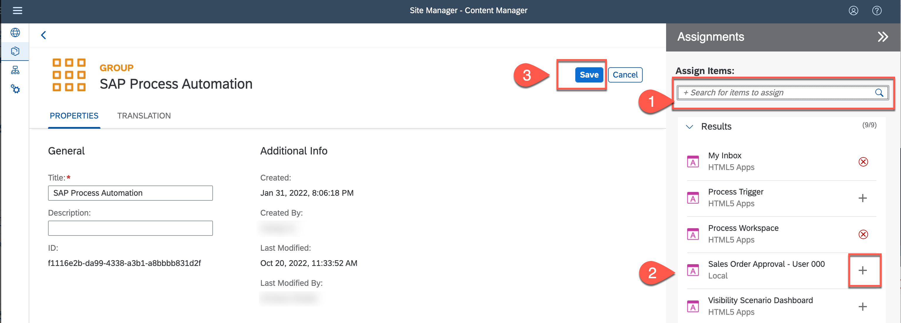
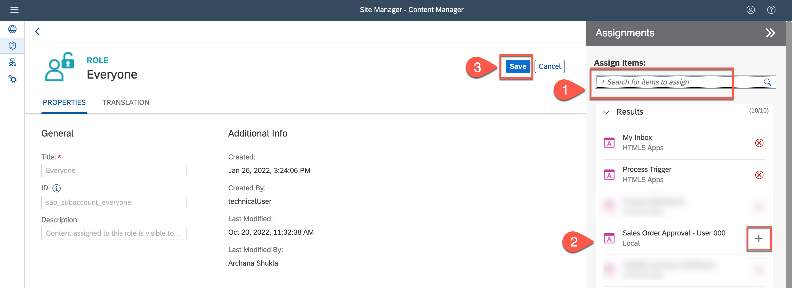

## Configure Launchpad to Start Business Process

## Table of Contents
- [Overview](#overview)
- [Create and Configure Launchpad Site](#configurelaunchpad)
- [Assign Sales Order Trigger Application to SAP Process Automation Group](#addtogroup)
- [Launch Site to Open Sales Order Trigger Form](#launchsite)
- [Summary](#summary)

## Overview 

Launchpad is the central access to different applications running on-premise and on-cloud, with a role based personalised site. It can be customised based on organisational needs, and provides integration with inbox, notifications and other central BTP services. In this exercise, you will create a Launchpad site to access `MyInbox` application and start business process using the embedded app.

For this workshop, the Launchpad service is added and configured in the SAP BTP account. Follow this [tutorial](spa-configure-launchpad) if you want to know more on how to configure launchpad service in your enterprise account.

## Create and Configure Launchpad Site 

As the Launchpad site is already created, you will add a new tile to trigger the business process that was created in the previous section. This tile will be added to **SAP Process Automation** site and you will start the business process using this application.

1. Click to [Open Launchpad](https://ad261-8v1n91fq.dt.launchpad.cfapps.us10.hana.ondemand.com/sites#Site-Directory) with the given username and password.
    - Choose **Content Manager** > **My Content** tab.

    | Username | Password    |
    | :------------- | :------------- |
    | AD261_XXX   where XXX is the user number   like AD261_000, AD261_001 etc.       | Acce$$teched22     |

  

2. Choose **Process Trigger**.

    

3. Choose **Create a Local Copy**.

    

4. Choose **Edit** to make changes to the **Process Trigger (Local Copy)** application.

    

5. Change the name of the app to **Sales Order Approval - User XXX** where XXX is your user number.

  - Select the tab **Navigation**.

    

7. Now you need to fill the **Default Value** of the app's parameters with the **Launchpad Configuration Parameter** of your process's **Trigger Settings**.

    

8. Navigate back to your deployed project in the **Application Development** and do the following:

    - Check if the **Deployed** version is selected
    - Select **Order Processing** process from the list of artefacts.

      

    - In the process builder, select the trigger form and then click to copy the **Launchpad Configuration Parameter**.

    >This is the parameter you need to configure as a tile in the SAP Launchpad Service.

    

9. Now navigate back to the Launchpad and paste the value in the **Default Value** field of the Sales Order Management app's parameters.

    

10. Select the tab **Translation** to change the **Title** to **Sales Order Approval - User XXX** where XXX is your user number.

    - Click to **Save**.

    

### Assign Sales Order Trigger Application to SAP Process Automation Group 

1. Navigate back to **My Content**.

    

2. Select **SAP Process Automation** group.

    

3. Choose **Edit** to make changes to the group.

    

    You will now assign the **Sales Order Approval** trigger to your group.

4. In the group, do the following:

    - Select the search bar.
    - Choose the **+** to add the **Sales Order Approval - User XXX** item.
    - Click **Save**.

    

## Assign Sales Order Trigger Application to Everyone Role 

1. Go back to **My Content**.

    

2. Choose **Everyone**.

    

3. Choose **Edit**.

4. You will now assign the **Sales Order Management** trigger to Everyone role. Do the following:

    - Select the search bar on the right-section.
    - Choose the **+** to add the **Sales Order Approval - User XXX** content.
    - Click **Save**.

    

## Launch Site to Open Sales Order Trigger Form 

1. Navigate back to the **Site Directory**.

    

2. Click to open the **SAP Process Automation** site.

    

    You will be directed to the Launchpad where the Sales Order Management tile has been created.

    You can now trigger the process from the launchpad.

3. Click to open your **Sales Order Approval - User XXX** tile.

    

    > You can also see `MyInbox` tile added to the launchpad which can be used by the business users to access the tasks.

    You will be redirected to the **Order Approval Request Form**.

    

## Summary 

You have successfully created and configured a new tile in SAP Launchpad to run the sales order approval process using the form. In the exercise, you have learnt how to:  
- [x] Add a process trigger to launchpad site.
- [x] Configure the process trigger application properties with title, navigation link and translation text.
- [x] Run the business process using the launchpad tile.

Continue to - [Exercise 8 - Run Business Process](../8_RunBusinessProcess/README.md)
