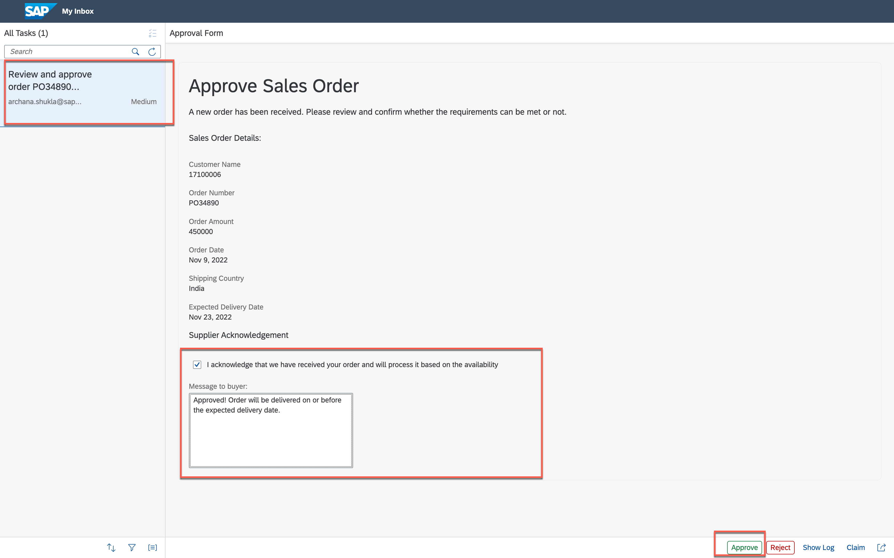

# Run Business Process

## Table of Contents
- [Overview](#overview)
- [Run Sales Order Process](#executeprocess)
- [Monitor Sales Order Process](#monitorprocess)
- [Approve Sales Order From MyInbox](#inbox)
- [Check Action Log ](#actionlog)
- [Summary](#summary)

## Overview 
In this exercise, we execute the automated process you have created and monitor the execution.

## Run Sales Order Approval Process 

1. Open the **[Launchpad](https://ad261-8v1n91fq.launchpad.cfapps.us10.hana.ondemand.com/site?siteId=493b85d5-0ecb-4a68-859b-e97e8ee1bf20#Shell-home)** with given username and password

    | Username | Password    |
    | :------------- | :------------- |
    | AD261_XXX   where XXX is the user number   like AD261_000, AD261_001 etc.       | Acce$$teched22     |

  - Click the tile that you added with title **Sales Order Approval - UserXXX** where XXX is your user number

  

3. Fill the form with following details and click **Submit**
    > This will start the business process

    | Form Field Name | Value    |
    | :------------- | :------------- |
    | Order Number  | any value like PO34890, 56390 etc. |
    | Order Amount | any number greater than 100000 |
    | Order Date | select any previous date from date-selector |
    | Ship To Party | 17100006   note: this is a customer ID in the   backend S/4HANA System|
    | Sales Order Type | OR   note: this stands for Standard Order  in the   backend S/4HANA System|
    | Sales Organization | 1710   note: this is the organisation ID already   existing in the backend S/4HANA System|
    | Distribution Channel | 10   note: this stands for Direct Sales distribution channel   in the backend S/4HANA System|
    | Division | 00   note: this stands for Product Division   in the backend S/4HANA System|
    | Shipping Country | any country name like India, Germany etc. |
    | Expected Delivery Date |  select any later date from the date-selector |

    > As per the process, if the order amount is > 100000 then it will go for approval or else it will auto-approved

    > The sales order information in the form has to filled based on the available business object values in the backend system such that the sales order gets created successfully in S/4HANA system.

    

## Monitor Sales Order Approval Process 

1. Return to the lobby and select **Montior** tab to monitor the process execution.

    

2. In the **Monitor** section, click **Process and Workflow Instances** to see process instances details

      

3. In process instance detail page, select your process instance to inspect the instance details.

      - Look the context section. In the context you will see the order details that you entered in the form.

      - Go to **Execution Log** and you will that the user task is waiting to be approved.

      

## Approve Sales Order From MyInbox 

1. Open **MyInbox** application from top-right corner of the screen,

      

2. In **MyInbox** application, and you will see a new task **Review and Approve order** with the given purchase order number in your inbox.

    > you can also search the inbox items with your purchase order number

    - Select the acknowledgement checkbox
    - Enter any comment of you choice
        > This comment will be sent to the requestor during final notification.

    - Click **Approve**

      

3. As per the process, once you approve the sales order - a explicit notification task is send to the approver to inform him of the approval with the comment from the supplier.

    - Click **Refresh** to get new tasks
    - Select task with your purchase order number having text **Your order PO has been successfully received**  

         > You will see the message from the supplier

    - Click **Submit** to acknowledge the response from the supplier.

    

## Check Action Log 

1. Go back to the **Monitor** application, select your process instance and observe the **Execution Log**

    - **Refresh** the logs from top-right corner of the screen.
    - You will see the log entry for **Action** execution which informs you that a POST API for Sales Order has been executed, with the given destination configuration.

    

2. Now click to open **CONTEXT** tab.

    - You can observe the process context as how it has been updated after successfully execution of each process step
      - Notice the output after the Action execution
        - Copy this SalesOrder number from the output to validate it in
      SAP S/4HANA system.

      

## Summary 

You've successfully built and executed an automated sales order process. Continue to the next exercise where you will open S/4HANA Cloud system to inspect the newly created sales order.

Continue to - [Exercise 9 - Access S/4HANA](../9_AccessS4HANA/README.md)
