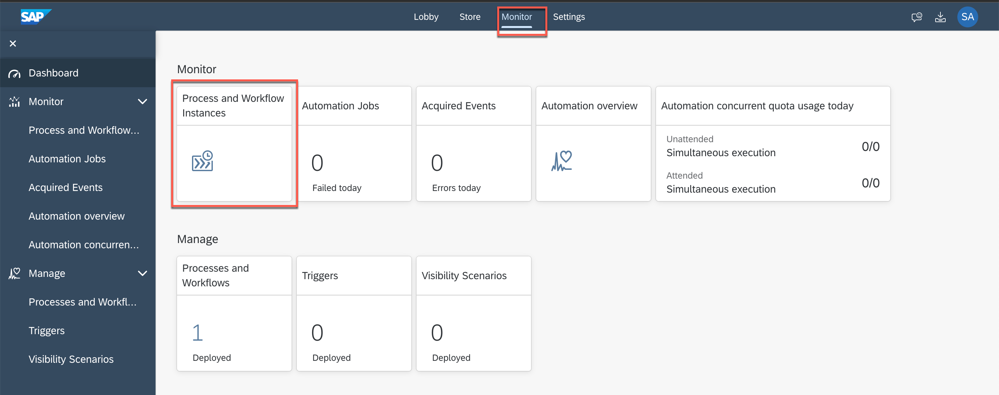

## Access S/4HANA Cloud System to View Sales Order

## Table of Contents
- [Overview](#overview)
- [Get Sales Order Number](#getsalesorder)
- [Open S/4HANA system](#opensystem)
- [Check Sales Order Created](#checksalesorder)
- [Summary](#summary)

## Overview 

Once you have successfully run the business process, a sales order will be created in the backend S/4HANA cloud system. Now let us check if the sales order was created in the system with the given purchase order number and other details (as filled in the approval form).

## Get Sales Order Number 

1. Once the Action is completed successfully, copy the sales order from **Process and Workflow Instances**
    - Goto **Monitor** section and click **Process and Workflow Instances**

      

    - Click to filter **COMPLETED** instances

      

    - Search for your Order Processing Instance
    - Click **EXECUTION LOG** tab
    - Check if the **Action** is completed
    - Open **CONTEXT** tab
    - Copy the sales order number
    > this is the sales order that is newly created in the backend S/4HANA system

    

## Open S/4HANA system 

2. Click to open [S/4HANA Cloud System](https://my401669.s4hana.cloud.sap/ui#Shell-home)

    - Username : AD261_XXX where XXX is the user number like AD261_000, AD261_001 etc.
    - Password: Acce$$teched22

      

3. Select **Sales Orders** tab, and then click to open **Manage Sales Order** tile

    

## Check Sales Order Created 

4. Enter the sales order number in **Sales Order**, click **Go**
    - once you find the sales order, click **>** to navigate to the sales order.  

    

5. You can now explore the sales order to check Ship to Party, Expected Delivery Date etc.

    

## Summary
